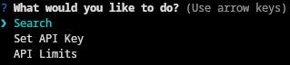
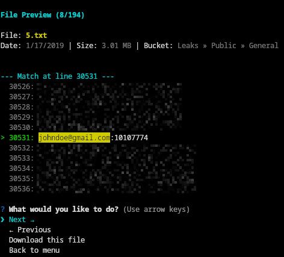
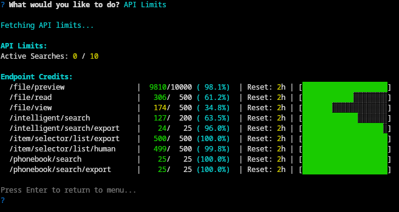
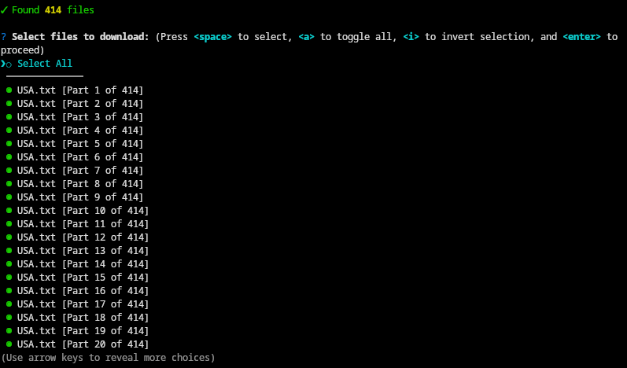
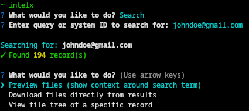

# IntelX Downloader

A Node.js CLI tool to preview and download files from intelx.io.

## Table of Contents

- [Features](#features)
- [Screenshots](#screenshots)
  - [File Previewing](#file-previewing)
  - [API Limits Display](#api-limits-display)
  - [File Selection](#file-selection)
- [Setup](#setup)
  - [Optional: Add a shell alias](#optional-add-a-shell-alias-for-quick-access)
- [Usage](#usage)
  - [Basic Usage](#basic-usage)
  - [Combolist Generation](#combolist-generation)
  - [Options](#options)
  - [Examples](#examples)



## Features

- **Interactive menu** for **searching**, setting **API key**, and viewing **API limits**
- **File previewing** - Browse through search results with context highlighting, pagination, and quick downloading options
- **Multiple download modes**:
  - Preview files with search term context
  - Download all files from a search result
  - View and download entire file tree of a specific record (zip file)
- **Multiple record selection** when search returns multiple results
- **Combolist generation** - Automatically extract username:password pairs from domain search results and save to a text file
- **API limit monitoring** - Warnings when API credits are low or exhausted

## Screenshots

### File Previewing
Browse through search results with highlighted context around your search term. Navigate between files, download individual files, or return to the menu.



### API Limits Display
Monitor your API credit usage with a detailed table showing current usage, limits, percentages, reset times, and visual progress bars.



### File Selection
Select multiple files from search results or file trees using an interactive checkbox interface. Supports "Select All" and individual file selection.



## Setup

1. Clone the repository:
```bash
git clone https://github.com/Zebratic/intelx-downloader.git
cd intelx-downloader
```

2. Install dependencies:
```bash
npm install
```

3. Run the script to access the interactive menu and set your API key:
```bash
node index.js
```

The `.env` file will be automatically created. Select "Set API Key" from the menu to configure your IntelX API key.

### **Optional:** Add a shell alias for quick access:

First, in the `intelx-downloader` directory, run:
```bash
pwd
```
Copy the printed path. Then add this line to your shell config file, replacing `<copied_path>` with the output from `pwd`:
```bash
alias intelx="node <copied_path>/index.js"
```
Reload your shell (`source ~/.bashrc` or `source ~/.zshrc`). Now you can run `intelx` from any directory.


## Usage

### Basic Usage

Run the script without arguments to access the interactive menu:
```bash
node index.js # or if you setup the command alias, just run `intelx`
```

The menu provides the following options:
- **Search** - Search for files using a query or system ID
- **Set API Key** - Configure or update your IntelX API key (returns to menu after saving)
- **API Limits** - View your current API credit usage and limits (returns to menu after viewing)

After completing any action, you'll return to the main menu automatically, allowing you to perform multiple operations in a single session.

Or provide a query or system ID directly to skip the menu and go straight to search:
```bash
intelx <query>
```

After completing the search and download operations, you'll return to the main menu.



### Combolist Generation

When searching for a domain (e.g., `example.com`), an additional option **"Generate combolist (username:password)"** will appear in the search results menu.

This feature:
- Automatically extracts username:password pairs from all search results
- Supports multiple formats:
  - `domain.com:username:password`
  - `domain.com/path:username:password`
  - `https://domain.com/path|username|password`
  - `domain.com/path|username|password`
- Removes duplicates automatically
- Allows you to specify how many files to process (or process all)
- Saves results to `<domain>.txt` in the current directory
- Shows warnings when API limits are low or exhausted

**Example:**
```bash
# Search for a domain
intelx example.com

# Select "Generate combolist (username:password)" from the menu
# Choose how many files to process (or press Enter for all)
# Results saved to example.com.txt
```

The generated file contains one credential per line in the format:
```
username:password
username:password
```

### Options

- `-o, --output <path>` - Specify output zip file path (default: `./<query>.zip` in current directory)
- `-h, --help` - Display help information

### Examples

```bash
# Interactive mode
intelx

# Search with query or system ID
intelx example@email.com
intelx 1d69f42e-3e31-46cc-a349-0870d07b3b61

# Search for a domain (enables combolist generation)
intelx example.com

# Custom output filename
intelx example@email.com -o my-download.zip
```
